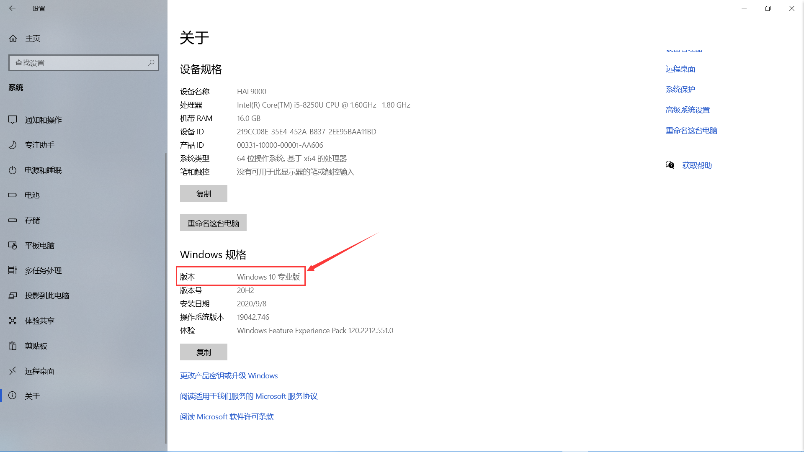
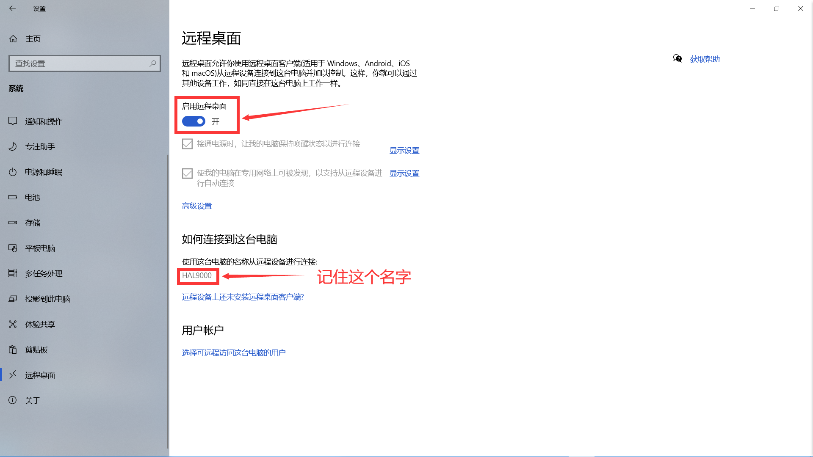
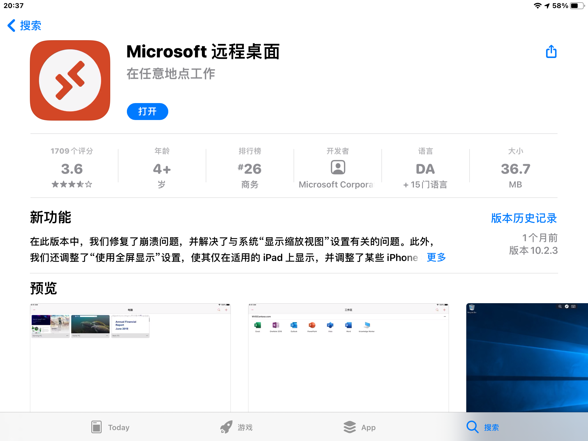
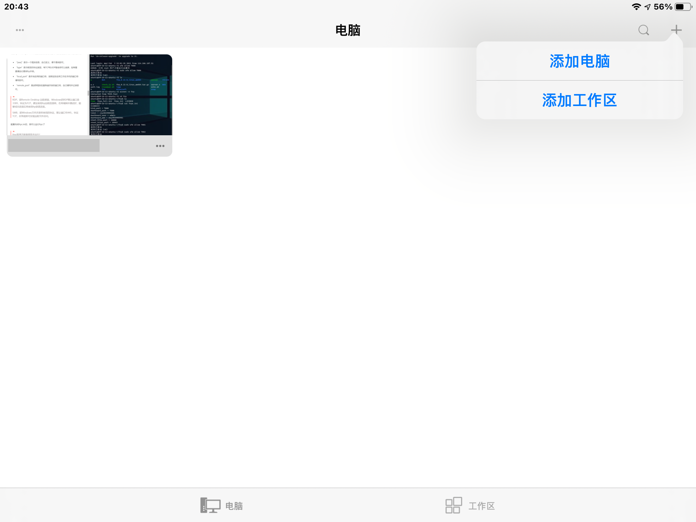
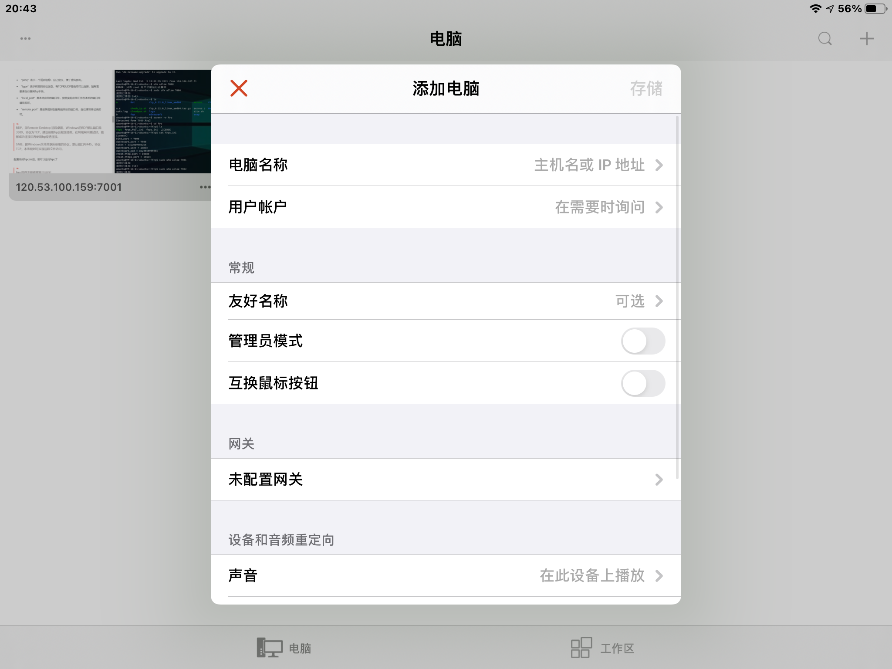
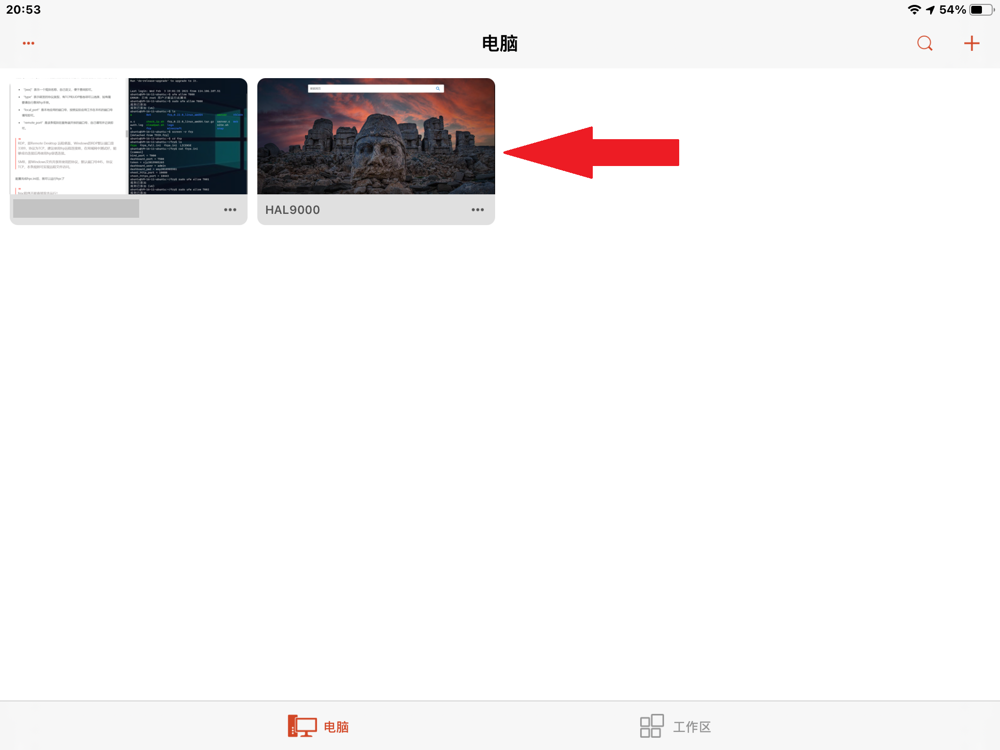
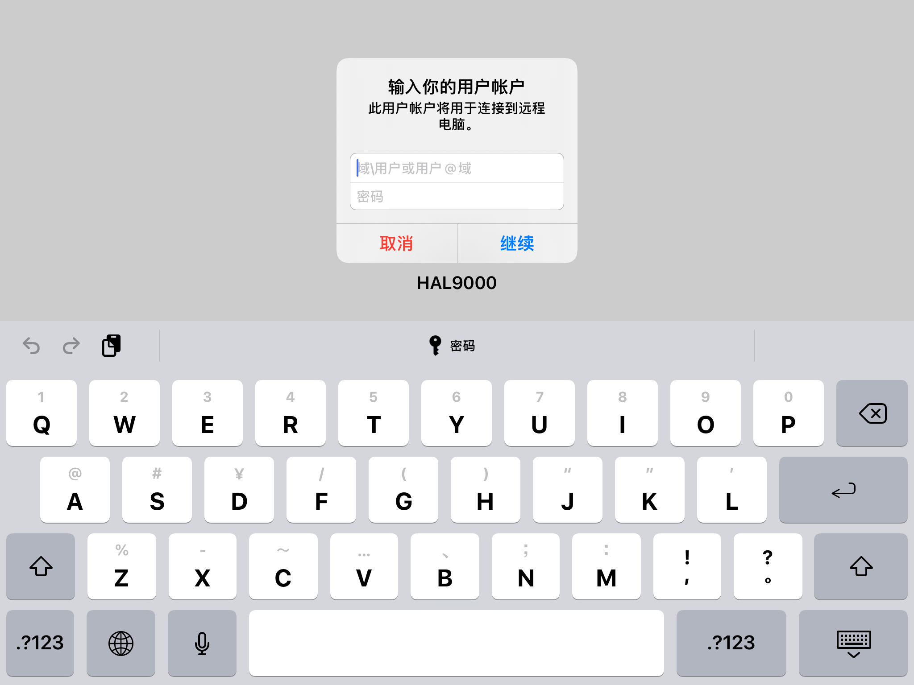

* 目录
{:toc}

## 一.了解RDP(Remote Desktop Protocal)
> 远程桌面协议(RDP)是一个多通道(multi-channel)的协议，让使用者(所在计算机称为用户端或'本地计算机')连上提供微软终端机服务的计算机(称为服务端或'远程计算机')。 

换句话说，有了RDP，你的电脑就可以进行远程连接，只要和电脑在同一局域网内，就可以实现在手机或平板乃至网页上控制你的电脑

## 二.如何在局域网内进行远程连接
### 1.确保你的电脑支持RDP
只有Windows 10专业版可以使用该功能。若要查看，请转到 开始> 设置> 系统> 关于 查看你的系统信息


### 2.开启远程连接功能
转到 开始> 设置> 系统> 远程桌面 启用远程桌面
记住底下你的电脑的名字，也可以稍后进行查看


### 3.在其他设备上连接你的电脑
这里以iOS为例，在AppStore上搜索并下载'Microsoft远程桌面'，并确保你的设备和电脑处于同一个WiFi下


打开后，点击右上角的加号，选择添加电脑


我们这里直接输入电脑名称，然后点击存储


点击刚刚存储好的电脑，输入你电脑账户的用户名和密码，然后点击继续，就可以控制我们的电脑啦



## 三.如何不在局域网内远程连接电脑
### 1.远程连接是如何工作的
首先我们要了解一些计算机网络的基本知识
### 2.选择合适的工具
经过与学长的讨论，有三种方案，你也可以选择适合自己的
* 1.VPN(虚拟个人专线)
    VPN是最安全也是最稳定的方案，但同时也是难度最高的，虽然我个人有搭建自用VPN的经验，但是麻烦得要死，我还是放弃了
* 2.frp(fast reverse proxy)
    方便，快捷，只是连个电脑完全够用了
* 3.花生壳等成熟的内网穿透工具
    优点是商业工具，已经很成熟了，而且有GUI几乎是傻瓜式的操作
    缺点是非常不稳定，个人不推荐，特别是在校园网特别垃圾的前提下
### 3.搭建frp服务器
#### (1)确保有一个处于公网的计算机
购买云服务器提供商的VPS或者自己找宽带运营商要公网IP，推荐前者
本人用的是腾讯云的学生机，1核1G 1M带宽的配置完全够用
这里以Ubuntu 18.04LTS系统为例，其他系统上的操作类似
#### (2)frp服务端部署
登录到服务器上，输入以下命令
```bash
wget https://github.com/fatedier/frp/releases/download/v0.22.0/frp_0.22.0_linux_amd64.tar.gz
```
**NOTE:请根据自己的系统架构选择相应的版本下载**
下载后解压
```bash
tar -zxvf frp_0.22.0_linux_amd64.tar.gz
```
文件夹改名，图个方便
```bash
cp -r frp_0.22.0_linux_amd64 frp
```
进入frp目录后，注意到有很多文件，我们只需要服务端相关文件，即s结尾的
* frps
* frps.ini
修改frps.ini文件
```bash
vim frps.ini
```
将文件内容修改为以下格式
```text
[common]
bind_port = 7000
dashboard_port = 7500
token = 12345678
dashboard_user = admin
dashboard_pwd = admin
```
>关键字说明
bind_port : frp程序监听的端口，是客户端与服务端通信的端口
dashboard_port : 面板端口，浏览器中用于监控程序使用情况
token ： 口令，用于和客户端的认证
dashboard_user : 用于面板的登陆
dashboard_pwd : 用于面板的登陆

端口若无必要，可以不修改
底下三项请自行设置
**NOTE:请确保防火墙开放相关端口**

修改完成后运行frp服务端程序
```bash
./frps -c frps.ini
```
若出现类似以下内容，表示成功运行
>2021/02/03 19:24:52 [I] [service.go:130] frps tcp listen on 0.0.0.0:7000
2021/02/03 19:24:52 [I] [service.go:172] http service listen on 0.0.0.0:10080
2021/02/03 19:24:52 [I] [service.go:193] https service listen on 0.0.0.0:10443
2021/02/03 19:24:52 [I] [service.go:216] Dashboard listen on 0.0.0.0:7500
2021/02/03 19:24:52 [I] [root.go:210] Start frps success

有关如何使程序在退出ssh后保持运行，请自行查阅screen或nohup等工具的使用
### 4.配置frp客户端
与上一步一样，下载并解压，并修改frpc.ini文件
按照以下格式修改
```text
[common]
server_addr = x.x.x.x
server_port = 7000
token = 123456
[rdp]
type = tcp
local_ip = 127.0.0.1           
local_port = 3389
remote_port = 7001  
[smb]
type = tcp
local_ip = 127.0.0.1
local_port = 445
remote_port = 7002
```
>关键字说明
server_addr : 你的服务器IP
server_host : 服务端设置的端口，若未修改就是7000
token ： 服务端设置的口令，请确保一致
type ： 连接类型，请查看frp手册
local_ip : 本机在局域网内的地址，基本不用修改
local_port : 本地相关服务需要的端口，请与相关程序的设置保持一致，比如rdp需要的就是3389
remote_port : 与服务器通信的端口，请确保服务器上防火墙开放该端口并未被其他进程占用
### 5.在其他设备上连接你的电脑
与[二.3](#3在其他设备上连接你的电脑)步骤一样，只不过在输入电脑名称时，换成 你的服务器ip:7001